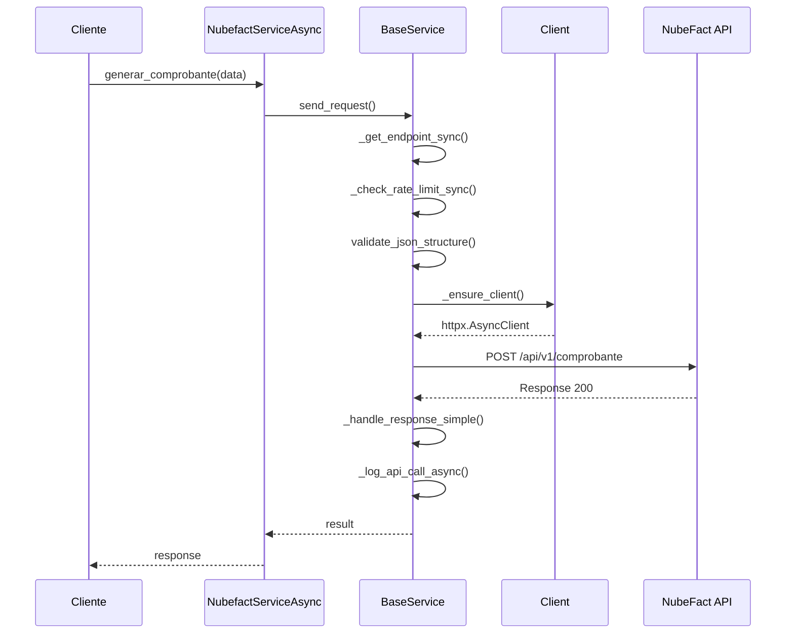
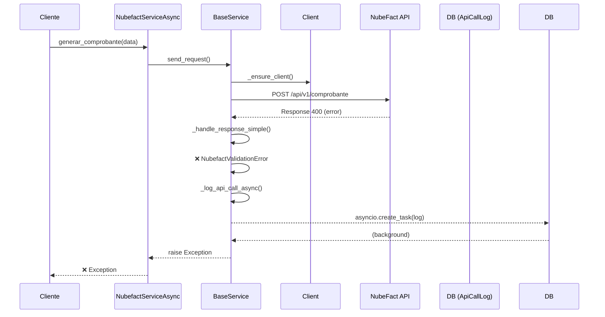

# 📋 PRIMERA ITERACIÓN: Estructura y Propósito

## 1. base_service.py - Clase Base Abstracta

```python
# Propósito: Clase base que define la interfaz común para servicios NubeFact
# Responsabilidades:
# - Configuración básica (URL, timeout, headers)
# - Manejo de endpoints
# - Rate limiting
# - Logging base
# - Manejo de respuestas HTTP

# Puntos clave a verificar:
# ✅ ¿Define métodos abstractos claros?
# ✅ ¿Maneja correctamente sync/async?
# ✅ ¿Gestión de tokens de autenticación?
```

## 2. client.py - Cliente HTTP

```python
# Propósito: Cliente HTTP especializado para NubeFact
# Responsabilidades:
# - Creación de sesiones HTTP
# - Manejo de timeouts
# - Reintentos (retries)
# - Conexiones persistentes

# Debe trabajar con:
# - httpx.AsyncClient para async
# - requests.Session para sync
```

## 3. config.py - Configuración

```python
# Propósito: Gestión de configuración del servicio
# Responsabilidades:
# - Cargar configuración desde BD (ApiService)
# - Variables de entorno como fallback
# - Tokens de autenticación
# - URLs base por entorno

# Problema anterior: Buscaba campo 'description' que no existe
```

## 4. exceptions.py - Excepciones Personalizadas

```python
# Propósito: Jerarquía de excepciones específicas
# Debe incluir:
# - NubefactBaseError
# - NubefactAPIError (errores HTTP)
# - NubefactValidationError (errores de validación)
# - NubefactAuthError (errores de autenticación)
# - NubefactRateLimitError
```

## 5. nubefact_service_async.py - Servicio Async Principal

```python
# Propósito: Implementación asíncrona del servicio
# Responsabilidades:
# - Métodos: generar_comprobante, consultar_comprobante, anular_comprobante
# - Logging completo (el que acabamos de corregir)
# - Manejo de batch requests
# - Rate limiting
# - Validación de datos

# ✅ Corregido: Ahora guarda logs correctamente
# ✅ Corregido: Maneja errores con logging
```

## 6. nubefact_service.py - Servicio Sync Principal

```python
# Propósito: Versión síncrona (wrapper sobre async)
# Responsabilidades:
# - Envolver métodos async con sync_to_async
# - Mantener misma interfaz que versión async
# - Útil para código legacy o síncrono
```

## 7. operations.py - Operaciones Específicas

```python
# Propósito: Lógica de negocio específica por operación
# Responsabilidades:
# - Construcción de payloads específicos
# - Validaciones por tipo de operación
# - Transformaciones de datos
```

## 8. schemas.py - Esquemas de Validación

```python
# Propósito: Definición de esquemas JSON para validación
# Responsabilidades:
# - Validar estructura de datos antes de enviar
# - Usar librería como pydantic o jsonschema
# - Garantizar que los datos cumplan especificaciones SUNAT
```

## 9. tests/ - Tests Unitarios

```python
# Propósito: Pruebas automatizadas
# Debe incluir:
# - Tests de validación de schemas
# - Tests de logging
# - Tests de manejo de errores
# - Mocks de respuestas HTTP
```

## 10. validators.py - Validadores Específicos

```python
# Propósito: Validaciones de negocio específicas
# Responsabilidades:
# - Validar RUC (dígito verificador)
# - Validar formatos de fechas
# - Validar montos
# - Validar estructura de items
```

---

# 🔍 SEGUNDA ITERACIÓN: Relaciones y Flujo

## Diagrama de Dependencias

```text
                    ┌─────────────────┐
                    │   exceptions.py │
                    └────────┬────────┘
                             │
                    ┌────────▼────────┐
                    │    config.py    │
                    └────────┬────────┘
                             │
                    ┌────────▼────────┐
                    │  base_service.py│
                    └────────┬────────┘
                             │
            ┌────────────────┼────────────────┐
            │                │                │
┌───────────▼────┐  ┌────────▼────────┐ ┌────▼───────────┐
│nubefact_service│  │nubefact_service_│ │    client.py    │
│      .py       │  │    async.py     │ └────────────────┘
└────────────────┘  └────────┬────────┘
                             │
                    ┌────────▼────────┐
                    │  operations.py  │
                    └────────┬────────┘
                             │
                    ┌────────▼────────┐
                    │   validators.py │
                    └────────┬────────┘
                             │
                    ┌────────▼────────┐
                    │    schemas.py   │
                    └─────────────────┘
```

## Flujo de una Petición Exitosa                    



## Flujo de Error con Logging




